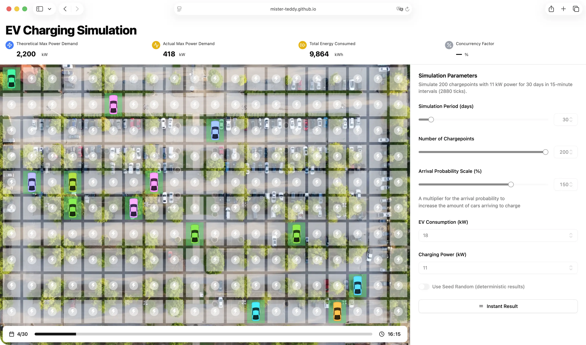
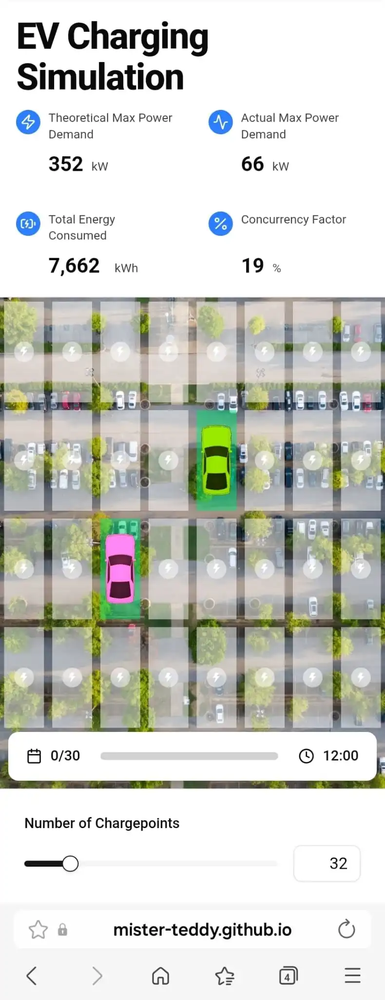

# Reonic EV Charging Simulation

Thank you for reviewing this submission! The results can be viewed directly on [GitHub Pages](https://mister-teddy.github.io/reonic-ev-charging-simulation/).

## Task 1

> Write a program to simulate 20 chargepoints with 11kW power for one year in 15-minute intervals (non-leap-year, 365 days / 35040 ticks).

Here is the result: https://mister-teddy.github.io/reonic-ev-charging-simulation/?logic

The code can be found in: [src/lib/simulate.ts](src/lib/simulate.ts) and [src/pages/task-1.tsx](src/pages/task-1.tsx).

### Notes

- > Run the program from task 1 for between 1 and 30 chargepoints. How does the concurrency factor behave?

  The fewer chargepoints, the higher the concurrency factor. Especially when you only have 1 or 2 chargepoints, there is a high chance that they all will be filled, leading to 100% concurrency. This effect can easily be seen with the UI in Task 2a.

- > If you consider the impact of DST vs. mapping the hours to the 15 minute ticks.

  If "DST" is Daylight Saving Time, then I think it has very little impact on this simulation, because:

  - The shift only affects the timestamps, not the actual hours of the day. And the given probability table is hour-based. So the actual simulation logic does not change.
  - The simulation period is usually long enough to either (1) even out the effect of DST (one hour lost <=> one hour gained), or (2) make the effect insignificant, due to only 0.94% arrival probability in that hour.
  - The complexity introduced is not worth it. Also, "The last Sunday in March" is year-specific.

- > If you seed the probabilities vs. using random() for random-but-deterministic results.

  This effect can easily be seen with the UI in Task 2a.

## Task 2a

> You are tasked with visualizing the input parameters and the output.

Here is the simulation: https://mister-teddy.github.io/reonic-ev-charging-simulation/

| Desktop Demo                                  | Mobile Demo                                 |
| --------------------------------------------- | ------------------------------------------- |
|  |  |

The code can be found in: [src/pages/task-2a](src/pages/task-2a/).

It was built with React, TypeScript, Tailwind CSS (with Shadcn UI). React Hook Form was used for both form input and some global state management, as I remember Sebastian's interest on utilising what already exists and not pulling in overkill libraries.

## Instructions to Run Locally

The [GitHub Pages site](https://mister-teddy.github.io/reonic-ev-charging-simulation/) should mimic the local setup closely, but if you want to run it locally, here is the instruction:

1. Install [pnpm](https://pnpm.io/). `pnpm` is very fast, and it uses symlinks to save disk space, especially when you have multiple projects using the same dependencies.
2. Install the dependencies with `pnpm install`.
3. Start the development server with `pnpm dev`.
4. Or build the production version with `pnpm build`, and preview it with `pnpm preview`.
